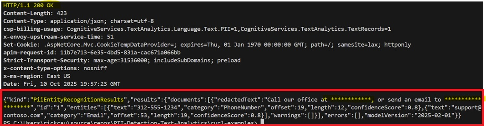

# Various Curl Examples of using the TEXT Language Services from AI Foundry to redact PII from data.

# Input data Example 1
Copy the following into an input file.  In this example, I have copied the following JSON structure into a file name `request.json`.

```
{
    "kind": "PiiEntityRecognition",
    "parameters": {
        "modelVersion": "latest"
    },
    "analysisInput": {
        "documents": [
            {
                "id": "1",
                "language": "en",
                "text": "Call our office at 312-555-1234, or send an email to support@contoso.com"
            }
        ]
    }
}
```

# Input data Example 2

```
{
    "kind": "PiiEntityRecognition",
    "parameters": {
        "modelVersion": "latest",
        "piiCategories" :
            [
                "Person"
            ]
    },
    "analysisInput": {
        "documents": [
            {
                "id": "1",
                "language": "en",
                "text": "We went to Contoso foodplace located at downtown Seattle last week for a dinner party, and we adore the spot! They provide marvelous food and they have a great menu. The chief cook happens to be the owner (I think his name is John Doe) and he is super nice, coming out of the kitchen and greeted us all. We enjoyed very much dining in the place! The pasta I ordered was tender and juicy, and the place was impeccably clean. You can even pre-order from their online menu at www.contosofoodplace.com, call 112-555-0176 or send email to order@contosofoodplace.com! The only complaint I have is the food didn't come fast enough. Overall I highly recommend it!"
            }
        ]
    }
}
```

# Curl Example 1
Copy the following Curl command and change the variables to point to you endpoint and provide your key, then run the command from the Terminal Window in VS Code.

```
curl.exe -i -X POST https://<YOUR_LANGUAGE_SERVICES_ENDPOINT>/language/:analyze-text?api-version=2024-11-01 `
-H "Content-Type: application/json" `
-H "Ocp-Apim-Subscription-Key: YOUR_LANGUAGES_API_KEY" `
-d `@request1.json
```

Here is an example of the type of response you should see from the POST request.  You should get a 200 response along with a JSON response that has the redacted text and some other metadata. 



You can now experiment with different payloads.  Now, change the command to use the request2.json payload and see how the API redacts the the data.